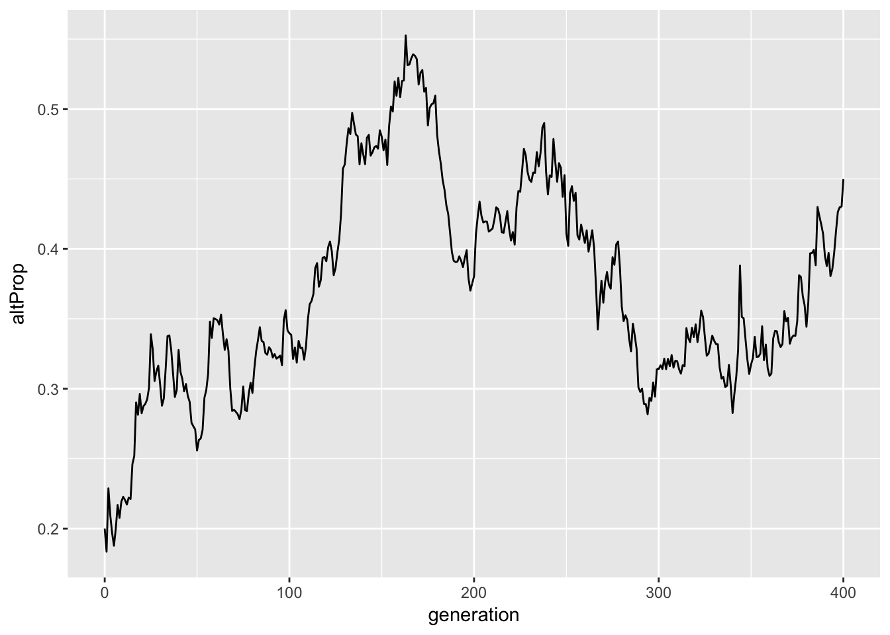

<br><br>
The R package **simaltruist** provides a convenient interfacing for running simulations to explore the spread of genes for altruism in an animal population.

## Scenario

Coming soon!

## Installation

Install the package from Git Hub:


```r
devtools::install_github("homerhanumat/simaltruist")
```

Then attach the package:


```r
library(simaltruist)
```

## Basic Usage

Here is a simple example:


```r
pop <- simulate(sim_gens = 400,
                warner_death_prob = 0.8)
```

<div class="figure" style="text-align: center">

<p class="caption">A graph for free!</p>
</div>

Here's the data stored in `pop`:

<!--html_preserve--><div id="htmlwidget-079f216c179fac901bc0" style="width:100%;height:auto;" class="datatables html-widget"></div>
<script type="application/json" data-for="htmlwidget-079f216c179fac901bc0">{"x":{"filter":"none","data":[["1","2","3","4","5","6","7","8","9","10","11","12","13","14","15","16","17","18","19","20","21","22","23","24","25","26","27","28","29","30","31","32","33","34","35","36","37","38","39","40","41","42","43","44","45","46","47","48","49","50","51","52","53","54","55","56","57","58","59","60","61","62","63","64","65","66","67","68","69","70","71","72","73","74","75","76","77","78","79","80","81","82","83","84","85","86","87","88","89","90","91","92","93","94","95","96","97","98","99","100","101","102","103","104","105","106","107","108","109","110","111","112","113","114","115","116","117","118","119","120","121","122","123","124","125","126","127","128","129","130","131","132","133","134","135","136","137","138","139","140","141","142","143","144","145","146","147","148","149","150","151","152","153","154","155","156","157","158","159","160","161","162","163","164","165","166","167","168","169","170","171","172","173","174","175","176","177","178","179","180","181","182","183","184","185","186","187","188","189","190","191","192","193","194","195","196","197","198","199","200","201","202","203","204","205","206","207","208","209","210","211","212","213","214","215","216","217","218","219","220","221","222","223","224","225","226","227","228","229","230","231","232","233","234","235","236","237","238","239","240","241","242","243","244","245","246","247","248","249","250","251","252","253","254","255","256","257","258","259","260","261","262","263","264","265","266","267","268","269","270","271","272","273","274","275","276","277","278","279","280","281","282","283","284","285","286","287","288","289","290","291","292","293","294","295","296","297","298","299","300","301","302","303","304","305","306","307","308","309","310","311","312","313","314","315","316","317","318","319","320","321","322","323","324","325","326","327","328","329","330","331","332","333","334","335","336","337","338","339","340","341","342","343","344","345","346","347","348","349","350","351","352","353","354","355","356","357","358","359","360","361","362","363","364","365","366","367","368","369","370","371","372","373","374","375","376","377","378","379","380","381","382","383","384","385","386","387","388","389","390","391","392","393","394","395","396","397","398","399","400","401"],[200,205,215,179,185,197,205,169,175,148,157,162,171,176,185,189,204,213,186,202,175,181,192,200,206,188,200,179,154,139,148,157,137,143,153,167,175,185,165,171,180,162,147,153,155,164,170,181,187,190,198,214,226,195,204,217,226,243,259,268,280,223,240,202,218,227,243,260,213,229,238,248,265,274,288,304,262,273,291,307,325,343,357,317,333,354,372,298,248,259,274,284,296,306,322,343,356,364,377,325,336,355,308,328,343,359,374,384,400,416,441,463,384,401,419,440,460,476,402,350,364,376,395,413,434,385,395,333,295,302,312,325,337,344,351,371,387,402,354,372,387,405,421,435,460,406,447,377,394,410,437,459,475,489,506,531,561,584,611,631,649,671,592,510,536,553,576,604,628,657,675,694,717,745,766,781,812,836,878,898,770,802,831,860,735,760,784,807,694,715,747,642,667,692,717,739,773,801,832,868,893,903,933,964,998,1018,1046,885,749,775,794,669,553,462,483,401,422,438,376,316,334,345,298,310,331,346,311,321,336,358,378,392,410,429,451,384,399,414,355,369,312,324,341,279,294,308,322,340,352,362,304,319,338,283,301,308,262,275,286,293,311,332,353,301,314,335,355,378,397,408,340,358,371,385,331,287,298,243,261,220,235,243,209,220,180,191,205,216,231,242,213,186,192,198,204,219,240,203,214,232,248,260,276,283,295,301,324,342,359,303,326,341,360,372,395,413,436,379,391,412,436,451,467,483,492,520,542,459,485,502,528,461,483,506,532,471,490,502,432,457,397,411,342,351,363,377,391,412,420,440,464,482,503,523,545,573,499,516,466,481,499,520,547,473,403,431,452,469,490,513,545,572,497,515,428,365,291,303,320,276,294,304,271,285,296,305,319,335,351,368,391,409,437,456,477,500,424,443,466,489,506],[100,103,108,91,96,100,100,80,85,75,79,82,86,88,92,93,101,108,93,103,90,91,97,101,107,93,100,87,72,63,69,76,71,75,78,82,85,90,84,86,91,80,66,70,71,77,80,84,87,89,94,100,106,93,98,104,109,117,123,126,135,112,122,99,109,112,119,126,104,114,116,120,126,131,140,148,133,137,142,149,159,167,177,154,157,164,174,141,121,127,132,137,141,147,156,164,171,171,177,157,162,167,145,154,161,171,179,183,193,202,210,223,182,193,201,209,217,225,180,154,158,164,173,183,198,169,174,148,127,130,132,140,148,150,155,166,178,185,171,181,191,200,214,226,237,217,238,201,212,220,237,248,259,263,274,285,301,315,327,333,345,356,318,268,282,291,304,320,328,338,349,360,371,389,403,412,429,436,450,457,404,418,437,449,386,404,422,439,382,391,410,347,361,372,385,397,412,433,451,461,473,476,489,501,516,527,537,467,396,413,420,351,293,241,250,212,221,230,194,162,174,176,152,156,166,173,152,155,164,178,190,199,209,217,226,196,203,212,180,186,157,164,174,145,156,160,168,178,185,189,158,168,179,154,164,170,141,146,154,158,166,177,190,163,169,178,192,206,215,218,182,190,197,206,184,160,168,132,142,119,126,131,109,111,92,97,104,108,115,120,105,90,94,94,96,104,113,98,104,110,118,123,131,135,141,144,151,161,168,150,160,168,177,188,201,211,218,185,198,210,225,231,242,246,254,266,275,237,251,261,269,233,236,248,260,229,236,246,213,221,200,201,166,174,181,188,196,209,215,229,238,248,260,270,285,295,253,265,242,246,251,264,276,238,205,218,231,243,256,266,282,298,256,266,225,200,156,161,170,146,152,154,138,146,151,151,160,166,173,180,195,204,221,227,242,252,212,223,235,249,260],[90,90,95,79,84,88,88,69,72,60,61,61,62,63,67,66,70,72,58,61,50,51,54,58,64,55,58,48,41,39,42,46,46,48,50,53,56,59,55,58,61,52,44,48,48,53,55,59,61,64,68,71,73,60,65,70,74,82,87,91,98,78,82,64,71,71,74,78,67,73,75,78,79,83,87,89,84,88,89,95,98,104,109,99,98,100,107,92,82,86,91,94,98,102,105,108,113,114,114,103,106,108,96,98,103,108,113,116,121,126,128,136,107,115,117,121,130,136,103,90,93,96,97,103,116,99,105,88,69,71,72,78,78,80,85,88,100,105,93,96,100,99,104,108,114,109,124,103,109,113,127,136,141,145,151,154,161,173,180,182,186,188,160,131,139,144,149,160,165,167,174,182,192,202,206,209,214,224,235,241,214,219,227,235,205,217,230,235,204,210,220,186,190,203,209,215,227,236,249,254,259,263,271,274,283,290,293,250,203,205,214,172,147,116,120,101,108,114,94,80,87,89,75,77,81,84,71,73,77,88,91,96,99,104,109,90,97,106,86,94,83,86,94,76,83,85,92,97,102,106,89,92,102,90,93,95,77,84,89,94,97,105,111,96,99,105,115,123,129,132,114,123,127,137,130,117,120,90,100,82,85,89,76,77,61,61,65,65,66,69,61,55,58,58,59,67,69,53,56,60,63,65,67,69,72,72,78,88,92,82,89,92,97,105,107,113,119,101,108,118,126,130,137,138,141,149,153,129,138,143,146,123,122,129,134,122,129,138,119,125,114,111,86,88,91,96,99,105,110,118,125,135,145,151,161,170,141,150,135,138,141,147,155,137,120,131,137,145,151,159,167,170,149,154,128,118,91,94,97,81,86,89,73,83,86,88,95,99,107,110,120,123,130,134,145,150,120,129,140,148,155],[0,2,2,2,2,2,2,2,3,6,8,10,12,13,13,14,16,20,20,24,26,26,29,29,29,27,29,28,23,18,21,23,20,22,23,24,24,26,24,23,24,22,19,19,20,21,22,22,23,22,23,26,30,29,29,30,31,31,33,32,34,32,38,34,37,40,44,46,36,40,40,41,46,47,52,57,48,48,52,53,56,57,61,50,51,56,59,44,35,37,37,39,39,41,46,51,53,52,56,50,52,55,47,53,54,59,62,63,67,71,77,82,72,75,81,83,81,80,70,60,59,62,69,72,74,64,63,57,55,56,56,56,63,63,63,69,69,70,70,77,82,88,97,104,108,95,101,88,92,93,96,98,100,100,105,109,116,119,120,123,128,131,129,115,120,123,131,134,138,147,150,153,151,159,168,174,180,179,181,179,164,172,179,180,160,162,163,173,158,161,171,149,155,153,159,162,162,170,175,178,186,185,188,196,202,207,215,199,178,193,191,167,137,117,122,103,105,108,93,76,78,78,68,70,76,78,72,73,76,79,84,88,93,96,99,91,89,90,81,79,66,70,72,63,66,68,68,74,76,76,65,71,72,60,67,69,61,59,62,61,66,69,76,66,67,70,73,79,82,82,67,66,69,68,53,43,46,41,41,37,41,42,33,34,30,35,37,41,46,47,42,35,36,36,37,37,41,43,46,48,52,55,60,62,65,68,69,68,71,64,67,71,73,74,83,86,87,81,87,89,94,95,99,100,100,103,105,94,99,103,105,95,99,102,107,92,92,93,85,88,79,80,71,75,76,77,79,85,86,90,92,90,91,92,97,96,90,91,88,89,91,97,99,89,78,80,86,89,95,97,104,112,98,103,92,78,64,66,72,65,66,65,64,62,64,62,64,66,65,69,74,76,84,84,88,93,85,85,85,90,94],[10,11,11,10,10,10,10,9,10,9,10,11,12,12,12,13,15,16,15,18,14,14,14,14,14,11,13,11,8,6,6,7,5,5,5,5,5,5,5,5,6,6,3,3,3,3,3,3,3,3,3,3,3,4,4,4,4,4,3,3,3,2,2,1,1,1,1,2,1,1,1,1,1,1,1,2,1,1,1,1,5,6,7,5,8,8,8,5,4,4,4,4,4,4,5,5,5,5,7,4,4,4,2,3,4,4,4,4,5,5,5,5,3,3,3,5,6,9,7,4,6,6,7,8,8,6,6,3,3,3,4,6,7,7,7,9,9,10,8,8,9,13,13,14,15,13,13,10,11,14,14,14,18,18,18,22,24,23,27,28,31,37,29,22,23,24,24,26,25,24,25,25,28,28,29,29,35,33,34,37,26,27,31,34,21,25,29,31,20,20,19,12,16,16,17,20,23,27,27,29,28,28,30,31,31,30,29,18,15,15,15,12,9,8,8,8,8,8,7,6,9,9,9,9,9,11,9,9,11,11,15,15,17,17,18,15,17,16,13,13,8,8,8,6,7,7,8,7,7,7,4,5,5,4,4,6,3,3,3,3,3,3,3,1,3,3,4,4,4,4,1,1,1,1,1,0,2,1,1,0,0,0,0,0,1,1,2,2,3,4,2,0,0,0,0,0,3,2,2,2,3,3,4,4,4,4,4,5,5,4,4,5,7,9,11,12,12,3,3,3,5,6,6,8,13,14,17,14,14,15,18,15,15,17,19,15,15,15,9,8,7,10,9,11,14,15,18,19,19,21,21,23,24,27,27,29,22,24,19,19,19,20,22,12,7,7,8,9,10,10,11,16,9,9,5,4,1,1,1,0,0,0,1,1,1,1,1,1,1,1,1,5,7,9,9,9,7,9,10,11,11],[100,102,107,88,89,97,105,89,90,73,78,80,85,88,93,96,103,105,93,99,85,90,95,99,99,95,100,92,82,76,79,81,66,68,75,85,90,95,81,85,89,82,81,83,84,87,90,97,100,101,104,114,120,102,106,113,117,126,136,142,145,111,118,103,109,115,124,134,109,115,122,128,139,143,148,156,129,136,149,158,166,176,180,163,176,190,198,157,127,132,142,147,155,159,166,179,185,193,200,168,174,188,163,174,182,188,195,201,207,214,231,240,202,208,218,231,243,251,222,196,206,212,222,230,236,216,221,185,168,172,180,185,189,194,196,205,209,217,183,191,196,205,207,209,223,189,209,176,182,190,200,211,216,226,232,246,260,269,284,298,304,315,274,242,254,262,272,284,300,319,326,334,346,356,363,369,383,400,428,441,366,384,394,411,349,356,362,368,312,324,337,295,306,320,332,342,361,368,381,407,420,427,444,463,482,491,509,418,353,362,374,318,260,221,233,189,201,208,182,154,160,169,146,154,165,173,159,166,172,180,188,193,201,212,225,188,196,202,175,183,155,160,167,134,138,148,154,162,167,173,146,151,159,129,137,138,121,129,132,135,145,155,163,138,145,157,163,172,182,190,158,168,174,179,147,127,130,111,119,101,109,112,100,109,88,94,101,108,116,122,108,96,98,104,108,115,127,105,110,122,130,137,145,148,154,157,173,181,191,153,166,173,183,184,194,202,218,194,193,202,211,220,225,237,238,254,267,222,234,241,259,228,247,258,272,242,254,256,219,236,197,210,176,177,182,189,195,203,205,211,226,234,243,253,260,278,246,251,224,235,248,256,271,235,198,213,221,226,234,247,263,274,241,249,203,165,135,142,150,130,142,150,133,139,145,154,159,169,178,188,196,205,216,229,235,248,212,220,231,240,246],[90,91,96,77,78,86,94,78,78,58,62,63,65,67,70,73,76,76,69,71,62,67,69,70,70,66,69,61,51,45,46,47,41,43,48,53,58,62,53,57,60,54,47,48,48,50,51,55,58,60,63,70,74,64,68,75,78,87,95,101,103,76,78,66,71,75,77,80,68,72,71,75,83,86,87,91,72,77,88,97,102,111,113,106,114,121,125,102,80,82,91,96,104,106,106,115,120,124,127,103,107,117,97,102,108,113,119,123,124,125,131,139,112,118,120,129,138,145,128,111,119,123,129,131,135,126,127,105,93,97,99,102,103,106,105,110,115,119,101,104,105,109,107,108,114,97,113,96,98,100,112,117,118,125,127,133,138,143,146,150,149,156,137,121,127,126,129,135,141,148,155,159,165,166,169,173,183,190,206,214,177,189,193,199,177,183,187,185,163,172,185,166,175,188,195,200,209,210,214,235,244,250,263,267,281,293,307,253,212,219,229,198,159,131,137,105,113,112,96,77,81,88,71,75,81,83,76,82,86,90,93,97,100,104,115,94,101,103,88,97,79,78,81,67,67,74,78,80,86,91,79,81,87,77,79,79,69,76,77,79,81,94,99,84,90,96,101,109,118,122,100,107,113,118,95,81,81,65,73,60,66,69,64,69,52,55,61,65,66,70,57,53,54,58,60,65,70,57,59,66,67,73,78,79,81,80,89,96,102,77,88,88,90,93,95,101,111,97,98,101,106,113,118,120,121,126,132,107,117,118,126,113,127,134,142,127,133,136,121,130,106,110,87,87,91,94,96,97,98,102,120,128,137,142,147,158,132,135,121,131,138,140,149,128,113,125,127,129,131,141,145,152,128,134,111,95,74,76,81,67,76,83,73,78,79,83,87,92,100,109,112,115,118,124,129,132,107,111,119,127,129],[0,1,1,1,1,1,1,1,2,5,6,7,10,10,12,11,15,17,15,19,19,19,22,25,25,25,26,26,25,25,27,27,19,19,21,25,25,26,24,24,25,24,30,31,32,33,35,38,38,37,37,40,42,35,35,35,36,36,38,38,39,34,39,36,37,39,45,52,40,42,47,49,52,53,56,60,53,55,57,57,57,58,59,52,57,64,65,48,41,44,44,44,44,46,52,56,57,59,62,57,59,63,59,65,66,67,68,70,74,79,90,90,82,82,90,91,94,95,86,81,81,81,82,83,86,78,82,73,69,69,75,76,78,80,83,84,83,84,74,77,79,81,85,86,91,79,83,70,75,80,79,85,88,91,92,99,108,112,118,127,131,129,115,102,106,115,120,125,135,146,145,149,154,162,166,169,173,180,187,190,163,166,171,177,146,146,148,155,131,133,131,115,114,115,119,120,127,128,137,138,141,142,146,157,161,160,166,145,129,131,133,110,95,86,90,79,82,90,80,68,70,72,68,70,74,78,72,72,74,78,80,81,85,90,92,82,82,86,76,75,67,73,77,62,66,69,71,75,74,75,64,66,67,50,56,58,51,52,54,55,63,60,62,53,54,60,61,62,63,67,58,61,61,61,52,46,49,46,46,41,43,43,36,39,36,39,40,43,49,50,50,43,44,44,46,48,55,46,49,54,59,60,63,65,69,71,78,78,80,67,68,75,81,80,87,89,93,86,84,90,92,95,94,99,99,108,113,97,98,102,109,100,103,107,112,105,109,108,93,100,89,92,80,79,80,81,84,87,88,88,85,85,85,91,93,99,95,95,85,86,92,98,103,91,79,82,88,90,95,98,107,108,100,102,84,66,58,63,66,61,64,65,57,58,62,67,68,72,73,74,78,82,88,93,94,104,96,98,100,99,103],[10,10,10,10,10,10,10,10,10,10,10,10,10,11,11,12,12,12,9,9,4,4,4,4,4,4,5,5,6,6,6,7,6,6,6,7,7,7,4,4,4,4,4,4,4,4,4,4,4,4,4,4,4,3,3,3,3,3,3,3,3,1,1,1,1,1,2,2,1,1,4,4,4,4,5,5,4,4,4,4,7,7,8,5,5,5,8,7,6,6,7,7,7,7,8,8,8,10,11,8,8,8,7,7,8,8,8,8,9,10,10,11,8,8,8,11,11,11,8,4,6,8,11,16,15,12,12,7,6,6,6,7,8,8,8,11,11,14,8,10,12,15,15,15,18,13,13,10,9,10,9,9,10,10,13,14,14,14,20,21,24,30,22,19,21,21,23,24,24,25,26,26,27,28,28,27,27,30,35,37,26,29,30,35,26,27,27,28,18,19,21,14,17,17,18,22,25,30,30,34,35,35,35,39,40,38,36,20,12,12,12,10,6,4,6,5,6,6,6,9,9,9,7,9,10,12,11,12,12,12,15,15,16,18,18,12,13,13,11,11,9,9,9,5,5,5,5,7,7,7,3,4,5,2,2,1,1,1,1,1,1,1,2,1,1,1,1,1,1,1,0,0,0,0,0,0,0,0,0,0,0,0,0,1,0,0,0,0,1,2,1,0,0,2,2,2,2,2,2,2,4,4,4,4,4,6,6,7,9,9,10,10,12,11,12,12,14,11,11,11,13,12,13,18,18,20,22,18,19,21,24,15,17,17,18,10,12,12,5,6,2,8,9,11,11,14,15,19,19,21,21,21,21,20,20,21,19,21,18,18,18,18,19,16,6,6,6,7,8,8,11,14,13,13,8,4,3,3,3,2,2,2,3,3,4,4,4,5,5,5,6,8,10,12,12,12,9,11,12,14,14]],"container":"<table class=\"display\">\n  <thead>\n    <tr>\n      <th> <\/th>\n      <th>populationSize<\/th>\n      <th>males<\/th>\n      <th>males0<\/th>\n      <th>males1<\/th>\n      <th>males2<\/th>\n      <th>females<\/th>\n      <th>females0<\/th>\n      <th>females1<\/th>\n      <th>females2<\/th>\n    <\/tr>\n  <\/thead>\n<\/table>","options":{"columnDefs":[{"className":"dt-right","targets":[1,2,3,4,5,6,7,8,9]},{"orderable":false,"targets":0}],"order":[],"autoWidth":false,"orderClasses":false}},"evals":[],"jsHooks":[]}</script><!--/html_preserve-->

<br><br>

## Writing and Using Custom Functions

The `simulate()` function provides for a certain amount of customization of two important phases in the simulation of a single generation:

* the way in which mating couples are formed;
* how warners behave when the population is under attack by a predator.

Both of these behaviors may be controlled and programmed by the user, by means of the parameters `mating_behavior` and `attack_behavior`.

### Mating Behavior

By default, the behavior of a mating couple of determined by the function `randomMatches()`, the source code of which is given below:


```r
randomMatches <- function(individuals, number_of_couples) {
  females <- subset(individuals, sex == "F")
  breedingFemales <- females[sample(
    1:nrow(females),
    size = number_of_couples,
    replace = FALSE), ]
  males <- subset(individuals,sex == "M")
  chosenMales <- males[sample(
    1:nrow(males),
    size = nrow(breedingFemales),
    replace = TRUE), ]
  list(females = breedingFemales, males = chosenMales)
}
```

As the code shows, the default behavior is for fertile females to select randomly from the set of males.

As for the arguments, `individuals` is a data frame that is computed at the beginning of each generation.  Each row represents a living member of the population.  The columns are:

* `id`:  a string giving the ID-number of the individual;
* `sex`:  the sex of the individual;
* `warner`:  a numerical variable with values 0, 1, or 2, giving the number of altruistic alleles the individual possesses.
* `mom`: a string giving the ID-number of the individual's mother;
* `dad`: a string giving the ID-number of the individual's mother.

It is possible to write one's own mating function and pass it to `simulate()` via the `mating_behavior` parameter.  An example of such a custom function is exported by **simaltruist** as `sexualSelection()`, the source code for which maybe be viewed [here](https://github.com/homerhanumat/simaltruist/blob/master/R/reproduce.R).

The formal parameters of the function are shown in the definition below:


```r
sexualSelection <- function(
  individuals,
  number_of_couples,
  prefs = matrix(1, nrow = 3, ncol = 3)
  ) {
  ## function body
}
```


Examples of its use are provided in the package documentation, e.g.:


```r
pop <- simulate(sim_gens = 200,
                mating_behavior = list(
                  fn = sexualSelection,
                  args = list(
                    prefs = matrix(
                      c(1, 5, 10, 1, 1, 1, 10, 5, 1),
                      nrow = 3,
                      ncol = 3))))
```

In the above example, the preference matrix is:

                male0     male1     male2
-----           ------    ------    --------
*female0*       1         5         10
*female1*       1         1         1
*female02*      10        5         1

We see that 0-allele females prefer 1-allele and 2-allele males.  In fact when presented with three males, one of each genotype, she is five times as likely to prefer the 1-allele male over the 0-allele male, and ten times as likely to prefer the 2-allele male over the 0-allele male. Zero-allele females have a reverse preference, and single-allele females are indifferent in their choice.

Note that `args` specifies only the value of the `prefs` parameter of `sexualSelection`.  The other two parameters of this function---`individuals` and `number_of_couples` are computed by `simulate()` and provided to `sexualSelection()` when it is called.

For custom mating functions the possible provided parameters are:

* `individuals`, the data frame described above;
* `number_of_couples`
* `relMatrix`, a matrix (described below) of relationship-degree between living individuals.

### Attack Behavior

By default the behavior of a warner when the population is under attack is governed by the function `warnRelatives()`, described in the package documentation.  Again it is possible for the user to pass in a modified version of this function or an entirely new function, via the parameter `attack_behavior`.

An example of an alternative attack-behavior function is the exported function [`warnWarners()`](https://github.com/homerhanumat/simaltruist/blob/master/R/attack.R), in which each warner warns only other warners, without regard to their relationship to him or her.

  Again it is only necessary to set the values of parameters that are not automatically provided by the `simulate()` function.  Provided values are as follows:
  
* `individuals`, described previously;
* three parameters provided to `simulate()`:
    * `warner_death_prob`
    * `nonwarner_death_prob`
    * `hider_death_prob`
* `relMatrix`, a matrix with row and columns names corresponding to the ID-numbers of all living individuals.  The cells give the degree of relationship between any given pair of individuals.


    


